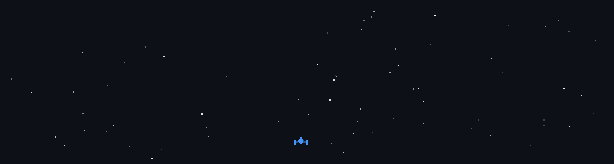

<h1 align="left">👋 Hola, soy Agustín</h1>

  

  🎮 Estudiante de la <strong>Licenciatura en Producción de Videojuegos & Entretenimiento Digital</strong> (UNRAF)  
  💻 Desarrollador Frontend & Game Developer  
  🎨 Interesado en experiencias interactivas, creative coding y videojuegos

---

### 🚀 Proyectos & Portafolio

- 🌐 **Portafolio Web**  
  👉 https://agustingalvan.netlify.app/

- 🕹️ **Videojuegos & Prototipos**  
  👉 https://agustingalvan.itch.io/

---

### 📬 Contacto

  
  

---

### 🛠️ Skills & Tools

  
  
  
  
  
  
  
  
  
  
  
  
  
  
  
  
  
  
  
  
  
  
  
  
  
  
  
  
  
  
  
  
  
  
  
  
  
  
  
  
  
  
  
  
  
  
  
  
  
  
  
  
  
  
  
  
  
  
  
  
  

---

### 🐍 Actividad en GitHub
###
<picture>
  <source media="(prefers-color-scheme: dark)" srcset="https://raw.githubusercontent.com/agusstingalvan/agusstingalvan/output/pacman-contribution-graph-dark.svg">
  <source media="(prefers-color-scheme: light)" srcset="https://raw.githubusercontent.com/agusstingalvan/agusstingalvan/output/pacman-contribution-graph.svg">
  
</picture>

###

###

---

### 🎮 Fun Stuff

  

